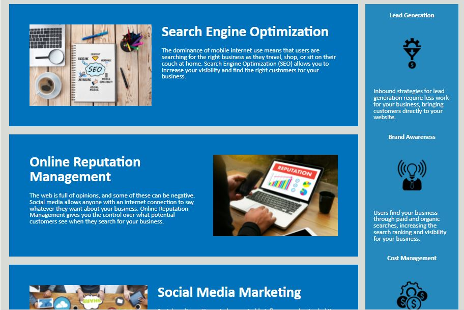

# 01-Html and Css\_: Code Refactoring

## Description

This excercise is intended to follow the journey of a support ticket placed by a marketing agency to make their existing website more accessible through refactoring the code to include proper semantic elements, comments, and alt image text.

The USER STORY for this project is as follows:
-AS A marketing agency,
-I WANT a codebase that follows accessibility standards
-SO THAT our own site is optimized for search engines.

Given this user story, this project took their existing codebase and refactored the code to remove multiple non-descriptive DIV elements and replace them with the proper semantic elements like HEADER, NAV, MAIN, ASIDE, and FOOTER.
Multiple redundant CSS elements were also combined and reorganized to facilitate better understanding of the site styling.

In the Html document, fixed one link that was not working due to a missing ID tag, verified proper function of the other two links. Also created ALT image text for all images to increase accessibility. To create the alt image for the main hero banner image, a SPAN was created with a role of IMG and a aria-label describing the image. Since this image does not contain any information not necessary to the understanding of the site, it is acceptable to have the image in the CSS without ALT text, but I felt it would be nice to be able to describe the image to a visitor using a screen-reader.

## Useage

This is a basic web application that functions to give information about the client's company. It can be accessed via any modern and legacy web browser.

Link to completed project:

This project meets all points of the Acceptance Criteria below:

1. Source code contains semantic HTML elements.
2. Source code elements follow a logical structure independent of styling and positioning.
3. Each image and icon has accessible ALT attributes.
4. The heading attributes fall in sequential order.
5. A consise, descriptive title has been added to the site.

Site Screengrabs to demonstrate visible appearance of the site was maintained throughout this exercise:

Reccomendations to further increase the site's functionality and accessibility to visitors on multiple devices:

Include responsive elements in the site's syling to allow resizing for mobile viewers.

## Credits

This project was created using existing codebase from student materials in the Georgia Tech Full Stack Development Bootcamp. Credit is due to the fantastic and knowledgeable teachers and TA's in the program for helping guide us through the course.

## License

MIT License

Copyright (c) [2022] [Michael Schenck]

Permission is hereby granted, free of charge, to any person obtaining a copy
of this software and associated documentation files (the "Software"), to deal
in the Software without restriction, including without limitation the rights
to use, copy, modify, merge, publish, distribute, sublicense, and/or sell
copies of the Software, and to permit persons to whom the Software is
furnished to do so, subject to the following conditions:

The above copyright notice and this permission notice shall be included in all
copies or substantial portions of the Software.

THE SOFTWARE IS PROVIDED "AS IS", WITHOUT WARRANTY OF ANY KIND, EXPRESS OR
IMPLIED, INCLUDING BUT NOT LIMITED TO THE WARRANTIES OF MERCHANTABILITY,
FITNESS FOR A PARTICULAR PURPOSE AND NONINFRINGEMENT. IN NO EVENT SHALL THE
AUTHORS OR COPYRIGHT HOLDERS BE LIABLE FOR ANY CLAIM, DAMAGES OR OTHER
LIABILITY, WHETHER IN AN ACTION OF CONTRACT, TORT OR OTHERWISE, ARISING FROM,
OUT OF OR IN CONNECTION WITH THE SOFTWARE OR THE USE OR OTHER DEALINGS IN THE
SOFTWARE.
